<div align="center">

# mbx-getstock-aws-puppeteer

### Serverless Stock Data Collector — Powered by AWS & Puppeteer

[](https://nodejs.org)
[](https://aws.amazon.com/lambda/)
[](https://aws.amazon.com/dynamodb/)
[](https://aws.amazon.com/s3/)
[](https://pptr.dev)
[](https://aws.amazon.com/serverless/)
[](./LICENSE)

<br/>

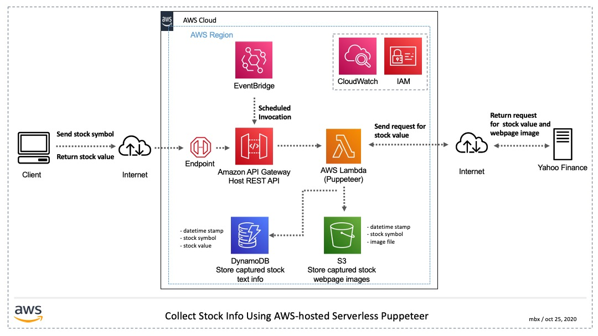

</div>

---

## Table of Contents

- [Introduction](#introduction)
- [Technology Stack](#technology-stack)
- [Architecture Overview](#architecture-overview)
- [How It Works](#how-it-works)
- [Setup Guide](#setup-guide)
  - [1. Configure the Lambda Function](#1-configure-the-lambda-function)
  - [2. Create AWS Resources](#2-create-aws-resources)
  - [3. Create Lambda Layer](#3-create-lambda-layer)
  - [4. Create the Lambda Function](#4-create-the-lambda-function)
  - [5. Configure API Gateway](#5-configure-api-gateway)
  - [6. Schedule with EventBridge](#6-schedule-with-eventbridge)
- [Testing the Solution](#testing-the-solution)
- [Results](#results)
- [Summary](#summary)
- [References](#references)

---

## Introduction

**mbx-getstock-aws-puppeteer** is a fully automated, serverless solution that gathers real-time financial data from the web. Hosted entirely on AWS, it accepts a stock symbol via a REST endpoint, navigates Yahoo Finance using a headless browser, extracts the current stock price, and captures a high-resolution screenshot — all without managing a single server.

---

## Technology Stack

| Layer | Service | Purpose |
|---|---|---|
| **Compute** | AWS Lambda (Node.js) | Executes scraping logic on-demand |
| **Orchestration** | Amazon EventBridge | Schedules periodic invocations |
| **API** | Amazon API Gateway | Exposes public REST endpoint |
| **Storage** | Amazon S3 | Stores webpage screenshot captures |
| **Database** | Amazon DynamoDB | Stores stock price records |
| **Automation** | Puppeteer + `chrome-aws-lambda` | Headless browser for data extraction |

---

## Architecture Overview

Data analytics solutions rely on rich data sources to hydrate data lakes and warehouses. When data isn't available through structured APIs, web scraping becomes a practical alternative. Puppeteer — originally built for automated browser testing — is a powerful tool for web data capture.

By deploying Puppeteer on AWS Lambda, this solution:

- **Scales automatically** — no idle servers, pure on-demand compute
- **Stores durably** — screenshots in S3, price records in DynamoDB
- **Runs periodically** — EventBridge cron rules trigger the pipeline on any schedule

---

## How It Works

A single API call kicks off the entire pipeline:

```
GET https://<api-id>.execute-api.<region>.amazonaws.com/dev/stock/{SYMBOL}
```

```
[EventBridge / Browser]
        │
        ▼
[API Gateway REST Endpoint]
        │
        ▼
[Lambda Function (Node.js + Puppeteer)]
        │
        ├──▶ [Yahoo Finance] ──scrape──▶ stock price + screenshot
        │
        ├──▶ [Amazon S3] ──save──▶ webpage screenshot (.jpg)
        │
        └──▶ [Amazon DynamoDB] ──save──▶ { timestamp, symbol, price, s3_link }
```

The key extraction is a single `page.evaluate()` call:

```js
price = await page.evaluate(() =>
  document.querySelector(
    "#quote-header-info > div.Pos\\(r\\) > div > div > span"
  ).textContent
);
```

---

## Setup Guide

### 1. Configure the Lambda Function

Before deploying, open [index.js](./index.js) and update these two constants with your own resource names:

```js
const dbname    = 'your-dynamodb-table-name';
const dstBucket = 'your-s3-bucket-name';
```

---

### 2. Create AWS Resources

Log in to your AWS account and provision the following:

- **S3 Bucket** — any unique name; this stores screenshot captures
- **DynamoDB Table** — partition key: `timestamp` (type: `String`), all other settings default

---

### 3. Create Lambda Layer

Build and upload the `chrome-aws-lambda` binary as a Lambda Layer. Follow the official guide:
[github.com/alixaxel/chrome-aws-lambda](https://github.com/alixaxel/chrome-aws-lambda)

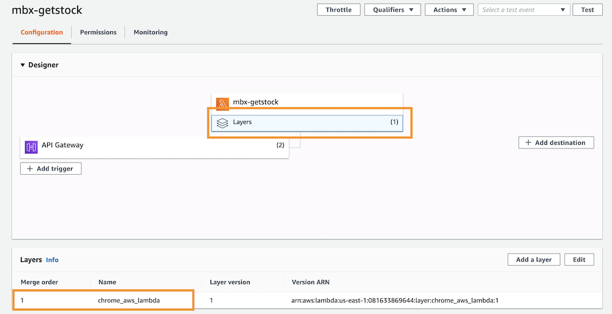

---

### 4. Create the Lambda Function

Create a Lambda function with the following settings:

| Setting | Value |
|---|---|
| Runtime | Node.js 12.x |
| Timeout | 3 minutes |
| Memory | 2048 MB |

Copy and paste the contents of [index.js](./index.js) into the Lambda code editor.

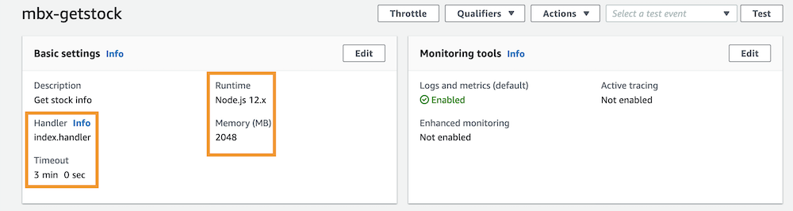

Then update the Lambda IAM execution role to grant access to **DynamoDB** and **S3**.

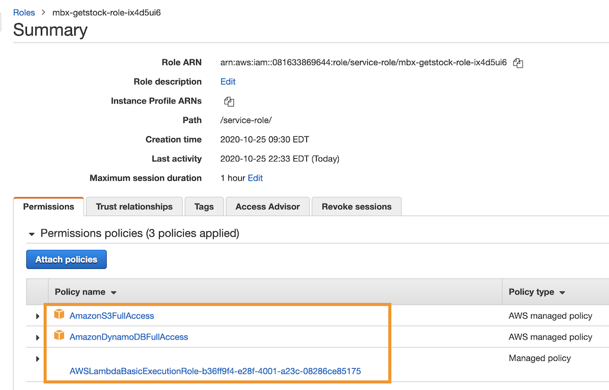

---

### 5. Configure API Gateway

Create a REST API with the following resource path structure:

```
/stock/{symbol}   →  GET  →  Lambda Integration
```

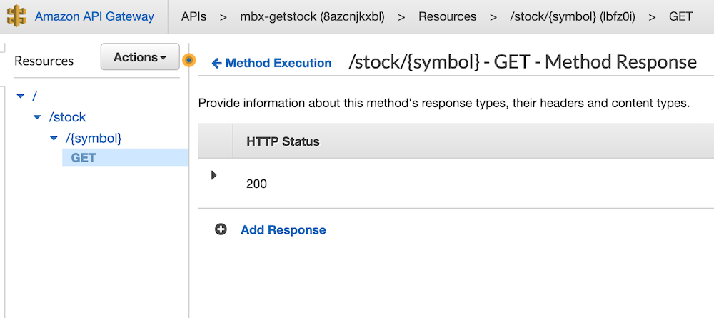

Set up Lambda proxy integration for the endpoint:

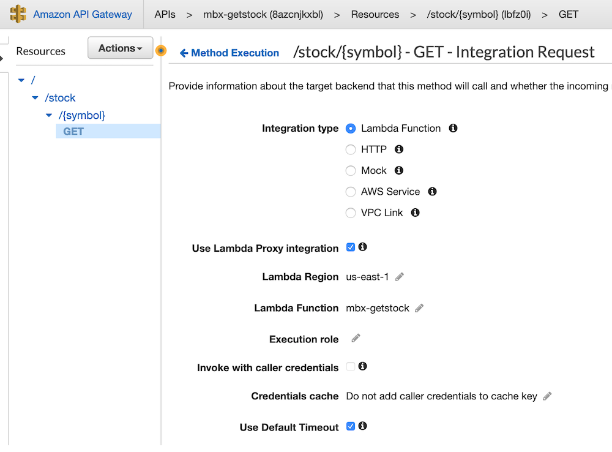

---

### 6. Schedule with EventBridge

Create one EventBridge Rule per stock symbol. Set the API Gateway resource as the target and configure a cron expression or rate expression.

> **Example:** `rate(15 minutes)` — invokes the API every 15 minutes for a given symbol.

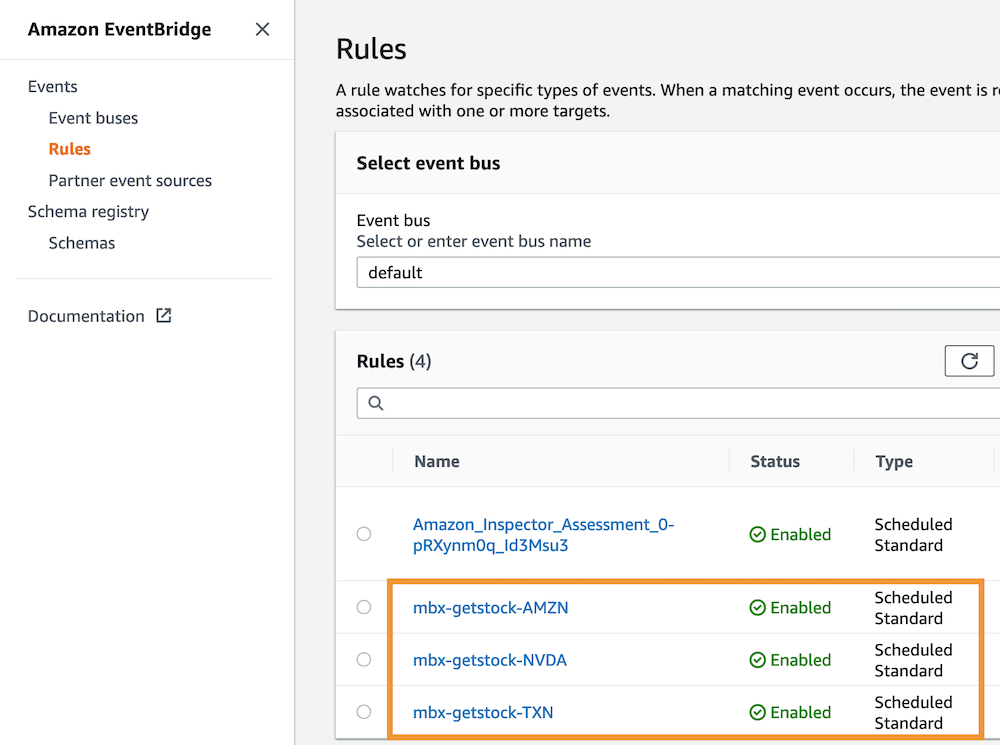
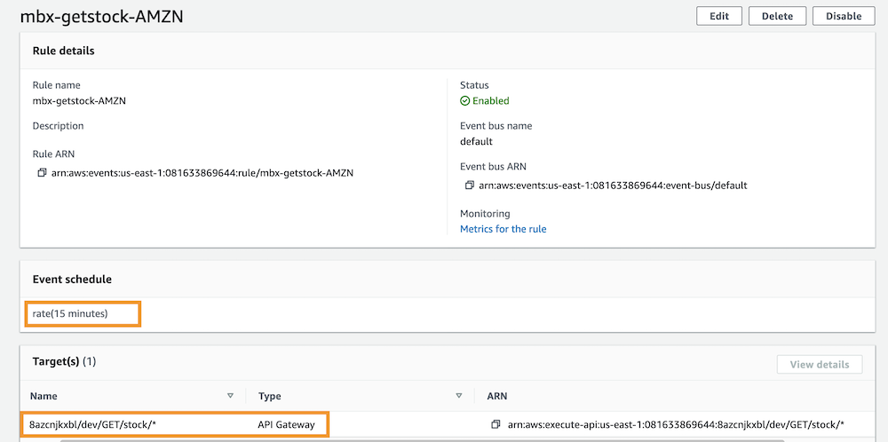

> Follow AWS best practices: apply least-privilege IAM permissions and enable encryption at rest and in transit.

---

## Testing the Solution

**Via Browser**

Navigate to your API Gateway endpoint with any stock symbol:

```
https://<account-id>.execute-api.us-east-1.amazonaws.com/dev/stock/IBM
```

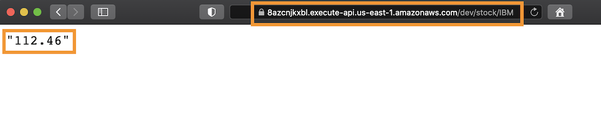

**Via API Gateway Test Panel**

Use the built-in test console to pass a stock symbol directly. Note: requests may occasionally time out — consider adding retry logic.

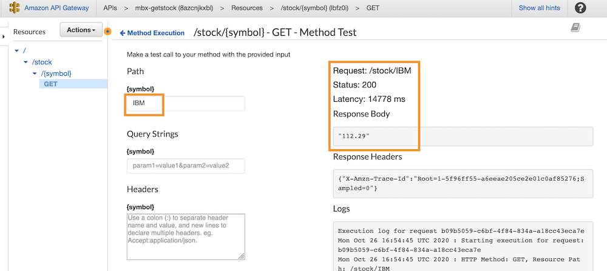

---

## Results

After a successful invocation, you'll find:

**DynamoDB** — a new record with `timestamp`, `stock_label`, `stock_value`, and an `s3_link`:

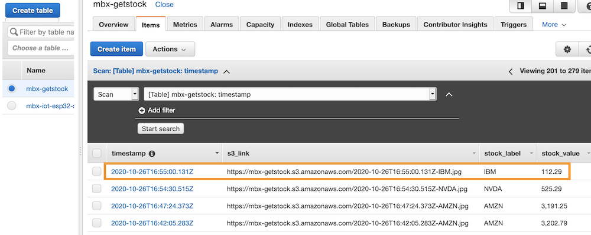
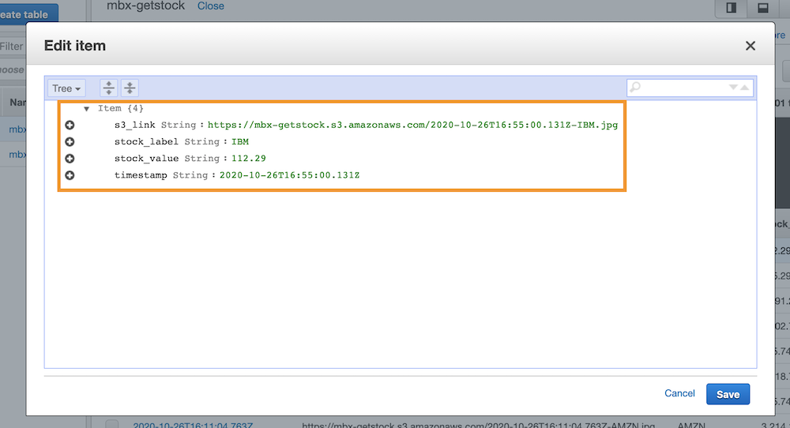

**S3** — a screenshot file named `<ISO-timestamp>-<SYMBOL>.jpg`:

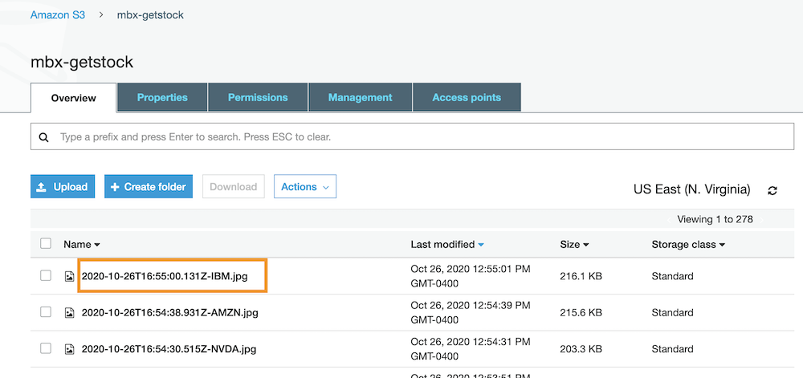
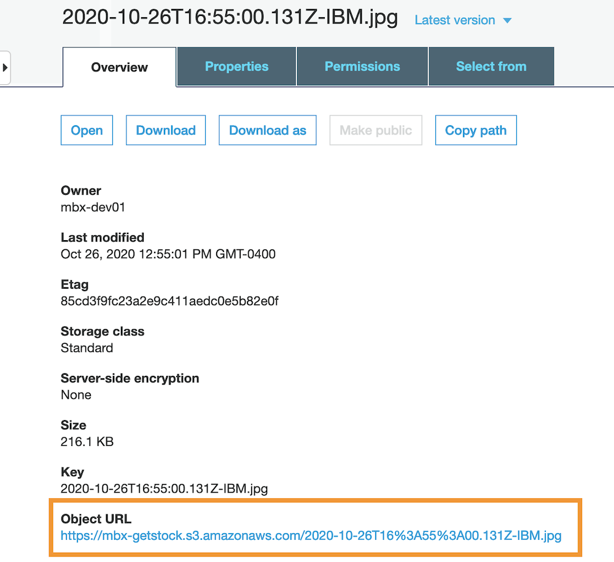
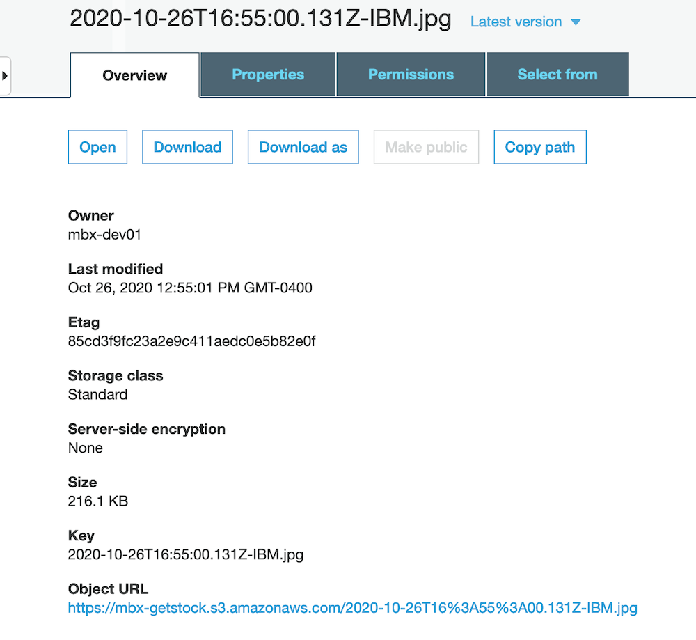

**Captured webpage screenshot** (e.g. AMZN):

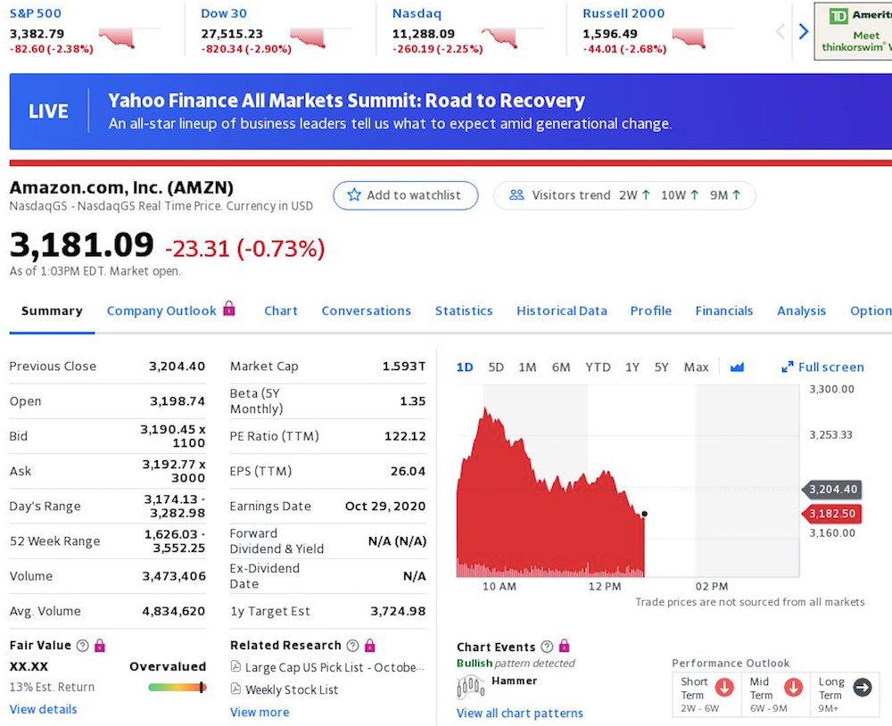
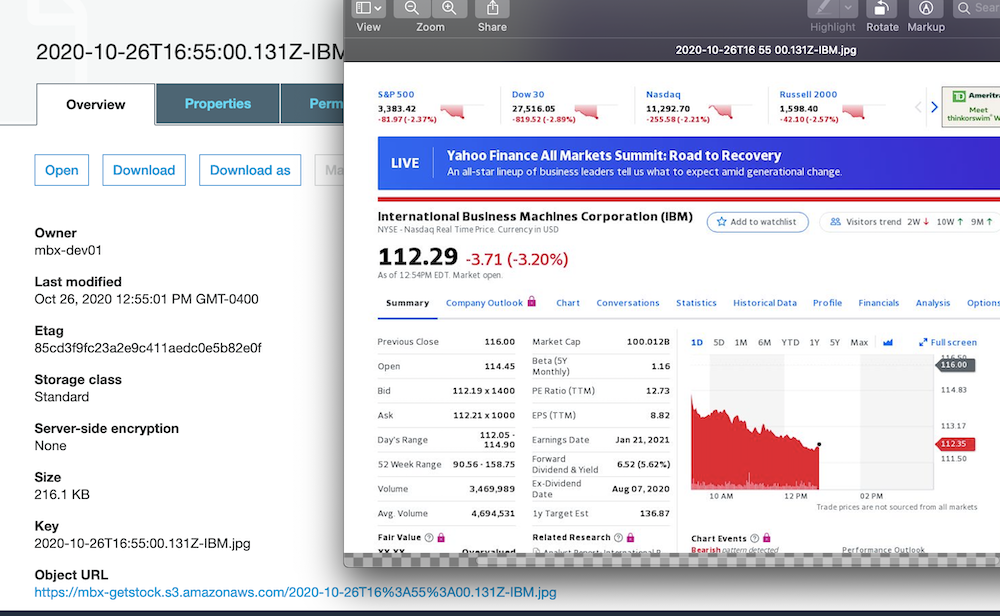

---

## Summary

`mbx-getstock-aws-puppeteer` is a blueprint for serverless web scraping on AWS. By pairing Lambda with Puppeteer, it eliminates the overhead of managing persistent scraping servers while offering seamless scaling through AWS's on-demand model. DynamoDB and S3 provide durable, queryable storage for both structured price data and visual page captures — making this pattern well-suited for feeding analytical pipelines and building long-running financial datasets.

---

## References

- [Puppeteer](https://github.com/puppeteer/puppeteer)
- [chrome-aws-lambda by Alix Axel](https://github.com/alixaxel/chrome-aws-lambda)
- [Web Scraper for Financial Data — Anthony M](https://medium.com/@mcleod333/web-scraper-for-financial-data-657c9b973ec5)

---

<div align="center">
  <sub>Built with Node.js · AWS Lambda · Puppeteer · DynamoDB · S3 · EventBridge</sub>
</div>
