# mbx-getstock-aws-puppeteer
This is an AWS hosted serverless solution to automate gathering stock info from the web using Puppeteer on AWS. The solution leverages AWS services such as Lambda, EventBridge, API Gateway, S3, and DynamoDB.
 

**Background**

Data analytics, and other data processing solutions, rely on a rich set of data sources to hydrate data lakes and data warehouses. Oftentimes this data is readily available in the form of structured databases and semi-structured datasets. Other times it has to be collected from remote sources via streaming solutions or API calls. 

When it comes to web-based data sources, typically data can be collected via APIs such as those published by social media providers. But not every data source exposes APIs or has APIs that are developer friendly. In such cases, web scraping can be a practical solution. Many tools exist to support web scraping. One of the more popular tools is Puppeteer, which is commonly used to automate testing of websites, but has been repurposed for web data capture. By leveraging the AWS cloud, we can deploy a serverless data collected solution using Puppeteer. This allows us to scale compute and storage resources seamlessly while ensuring high availability using the on-demand cost model. 

**Overview of Solution**

This serverless solution is triggered manually or periodically to collect stock info from the Yahoo Finance website. You pass a stock symbol to a REST endpoint and the solution will return back and saves the value of the stock as well as a image webpage capture of the latest stock information page. This is an example of a captured webpage for the AMZN stock symbol.

The solution can be invoked manually from a browser, for example, or via a scheduled invocation using EventBridge. The REST API is managed by the Amazon API Gateway service which exposes an endpoint. The processing is handled by a Lambda function which calls the Puppeteer library packages in a Lambda Layer. The returned results are passed back to the endpoint as a response document, as well as stored in DynamoDB and S3. The solution can be modified easily to collect data from almost any website. 

**Solution Components**

* Puppeteer: A Node library which provides a high-level API to control Chrome or Chromium over the DevTools Protocol. Puppeteer runs headless by default but can be configured to run full (non-headless) Chrome or Chromium. https://pptr.dev/

* Amazon API Gateway: AWS service for creating, publishing, maintaining, monitoring, and securing REST, HTTP, and WebSocket APIs. In this solution, it will expose an endpoint that when invoked, it will trigger a Lambda function that will process the request to capture a webpage, save the captured image to an S3 bucket and DynamoDB table.

* Lambda: Serverless compute service that executes the NodeJS logic, using Puppeteer, to process the webpage data and image capture request. 

* S3: Serverless object storage to save stock info screen captures. The name of the image capture file is a concatenation of the datetime stamp and stock symbol. 

* DynamoDB: Serverless NoSQL database to store basic stock info. I am storing a datetime stamp, the stock symbol, the stock value, and the url to the captured image in S3. 

* EventBridge: Serverless scheduler that can call a number of AWS services and pass parameters. I am using this service to periodically call the API Gateway endpoint with different stock symbols. 

* IAM: This is the foundational authentication and authorization service in the AWS cloud. 

* CloudWatch: This is the core monitoring service in the AWS cloud. 

**Solution Outline**

* Update the Lambda function with names of the the S3 bucket and DynamoDB table that you will create for this solution in the next steps:
  * const dbname = 'your table name'; 
  * const dstBucket = 'your s3 bucket name'; 

* Log-in to your AWS Account.
* Create an S3 Bucket.
* Create a DynamoDB table with a partition key "timestamb" and type string. Keep other defaults. 
* Create a Lambda Layer to host the chrome-aws-lambda binary. 

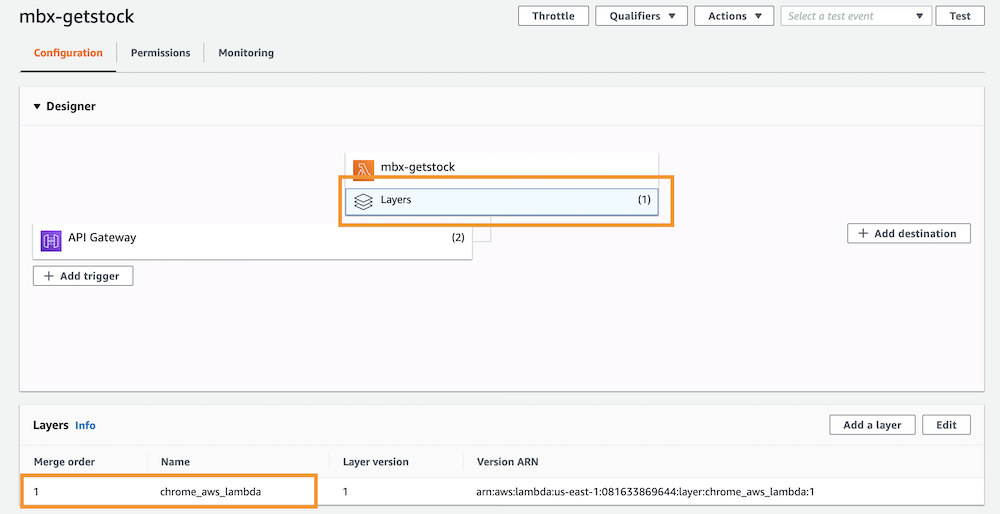

* Create Lambda using the following settings: Nodejs12, Duration: 3 min, RAM: 2048.

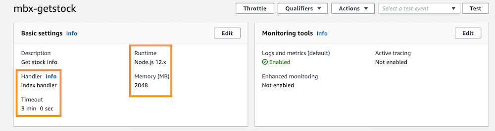

* Update the Lambda IAM role to authorize it to access DynamoDB and S3.

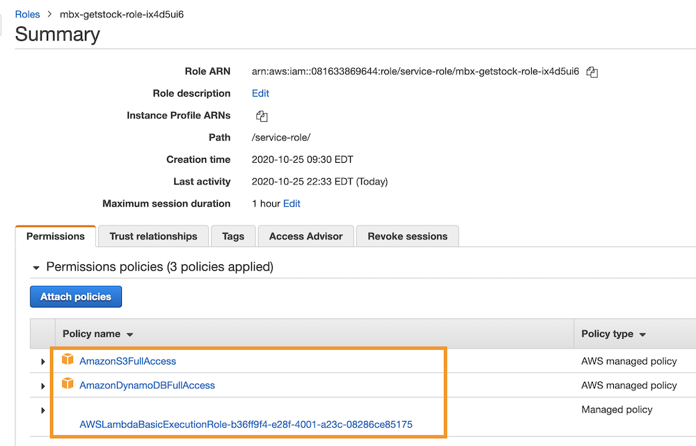

* Copy/Paste the code in the index.js file in this repo into the blank Lambda function code panel. 

* Create a REST API using the API Gateway using the following structure. 

* Setup Lambda Integration for the API
   

 
* EventBridge: Create a Rule per stock symbol. Use the API you have created in the API Gateway as a target. You can enter a cron expression or a frequency of execution to determine when or how often the API should be executed. For this solution, I have selected 15 minute  between Rule invocations. 

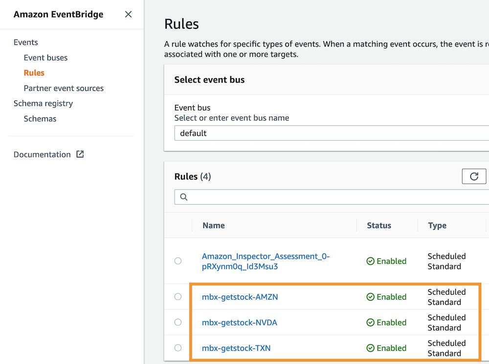
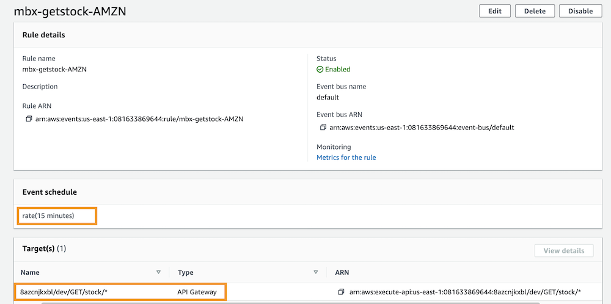

**Test The Solution**

* From your browser, enter the API Gateway endpoint. The format should look similar to the following url but with your specific account and region info: https:// 111111111.execute-api.us-east-1.amazonaws.com/dev/stock/AMZN

* From the API Gateway test panel.

* You can also use EventBridge to schedule invocation of API calls

After the API is invoked successfully with a stock symbol, you will find a DynamoDB entry containing a timestamp, stock symbol, stock value, and a link to the captured webpage image in your solution S3 bucket.

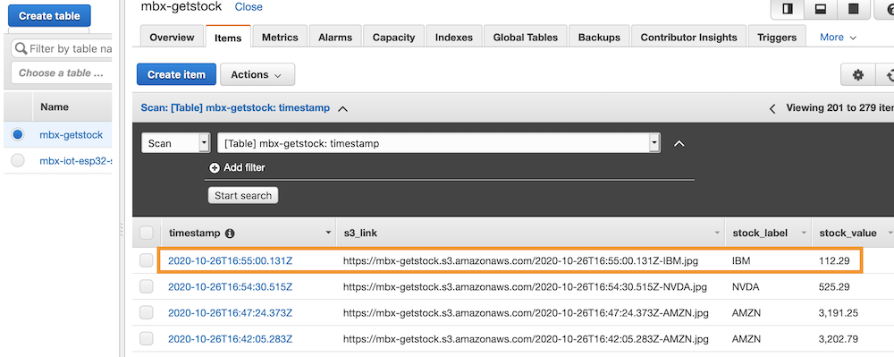

Click on the relevant entry to see the full table record for the stock.

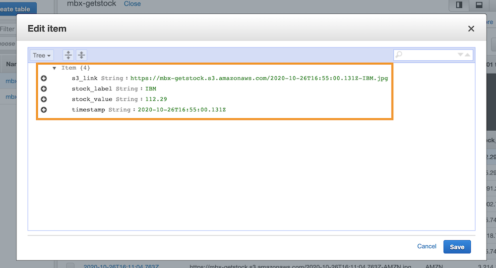

Check the S3 bucket for a file that corresponds to the one listed in the DynamoDB entry. 

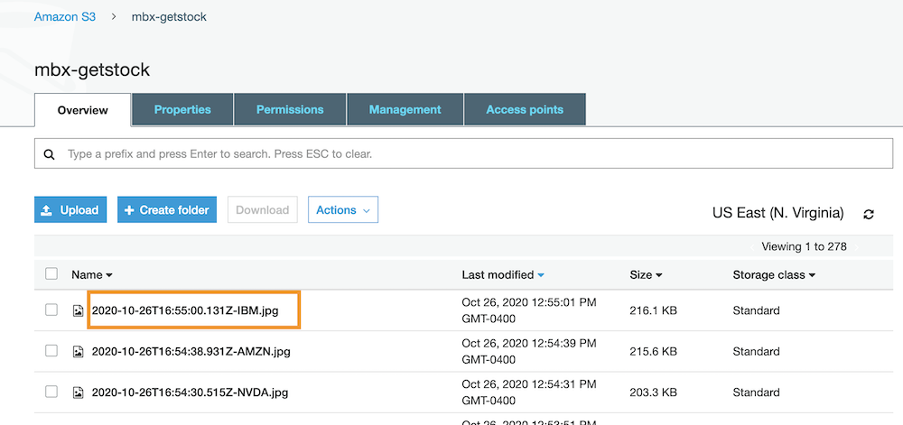

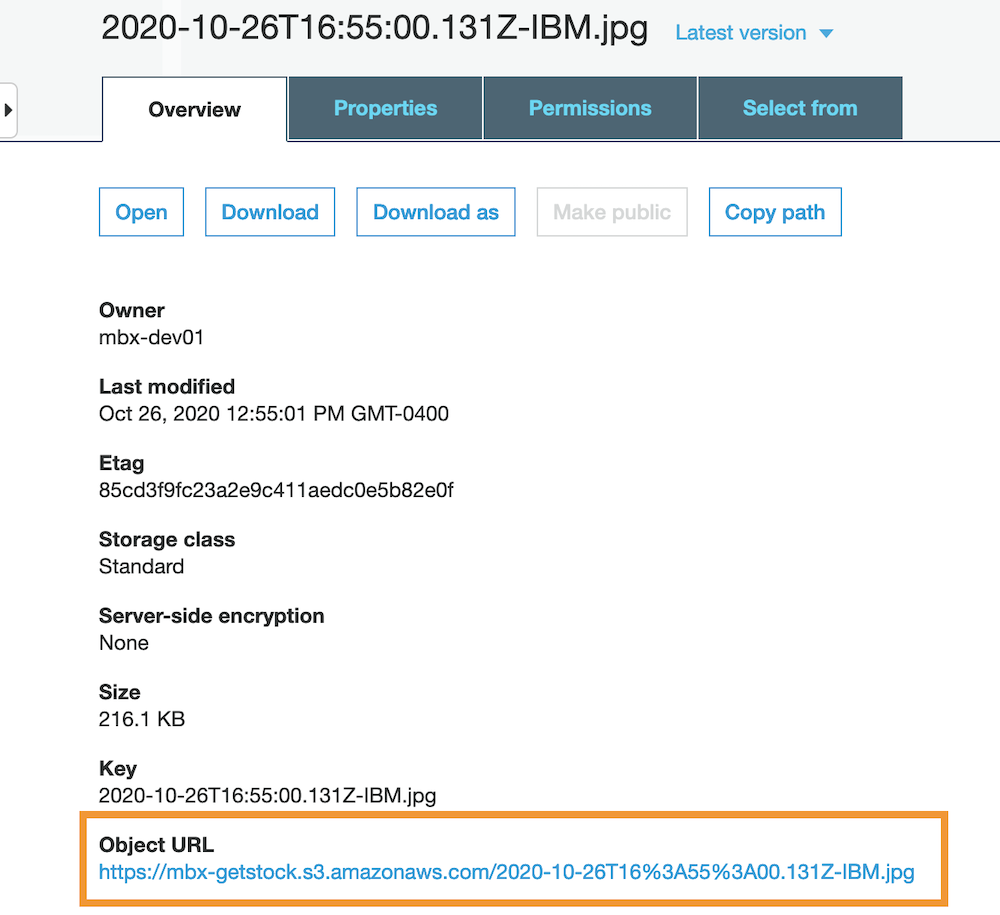

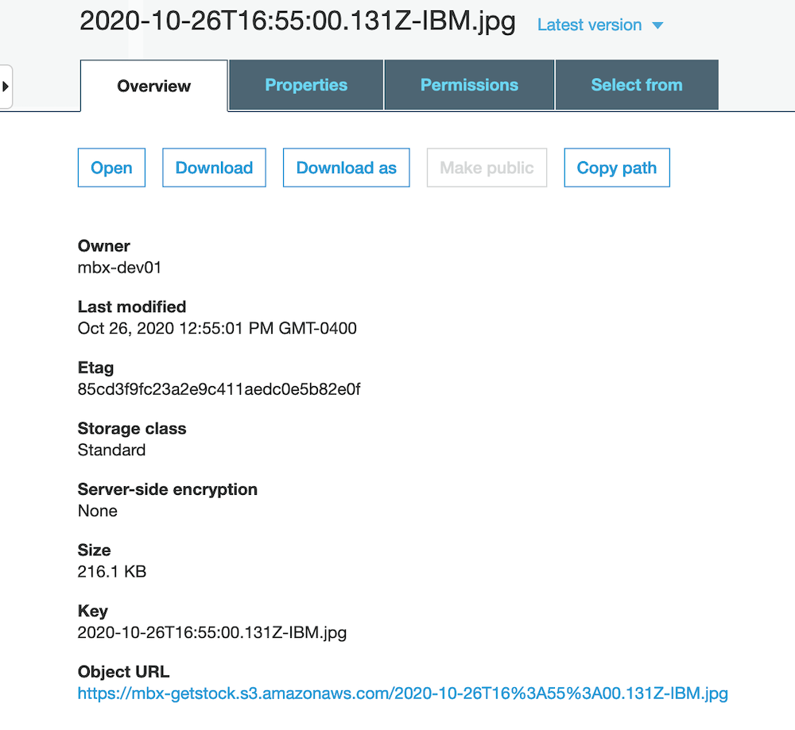

If you open the image file, you should see the webpage captured image for the stock.

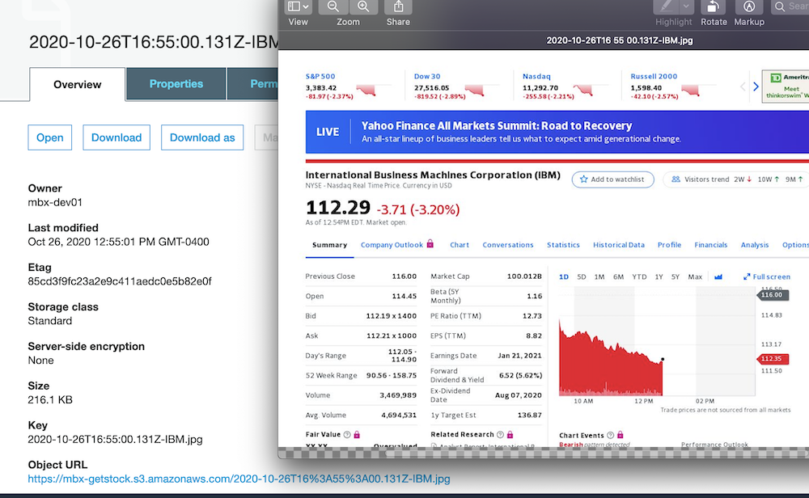

**References**
* Puppeteer https://github.com/puppeteer/puppeteer
* Deploy chrome-aws-lambda by Alix Axel https://github.com/alixaxel/chrome-aws-lambda
* Web Scraper for Financial Data by Anthony M https://medium.com/@mcleod333/web-scraper-for-financial-data-657c9b973ec5
